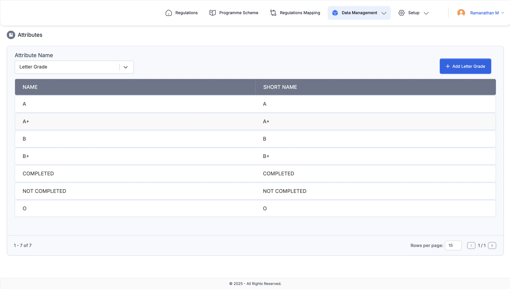

# Regulations - Internship Project
This module is a part of the Laudea product, developed during my internship at **PSG Software Technologies**. Its primary purpose is to manage and version the regulations and programme schemes offered by the college. The module facilitates the addition of grading systems, evaluation schemes, credits, and regulations. Programmes adhering to these regulations can also be managed efficiently.

### Key Workflow:
1. **Regulation Approval**: Regulations must be approved by the concerned authority before being listed in the "Programmes by Regulation" page.
2. **Programme Management**: Programmes under a regulation can have courses added via a model or Excel import. These courses must then be confirmed by the authority, either in bulk or individually.
3. **Outcome Management**: Programme Outcomes (PO) can be added for programmes, and Course Outcomes (CO) can be added for each course. PO approval is required before adding COs. Both must be confirmed by the authority.

This streamlined workflow addresses a significant manual administrative challenge faced by colleges, making the process more efficient and reliable.

This project is built using the **MERN stack** (MongoDB, Express.js, React.js, Node.js) to efficiently manage and streamline regulatory processes for academic institutions.

## Features
- **MongoDB**: Database for storing and managing data.
- **Express.js**: Backend framework for building APIs.
- **React.js**: Frontend library for building user interfaces.
- **Node.js**: Runtime environment for executing server-side JavaScript.

## Screenshots

### List Attributes

### Add Attributes

### List Grading

### Option Bar Grading

### Add Grading

### List Evaluation Schemes

### Option Bar Evaluation Schemes

### Add Evaluation Scheme

### List Credits

### List Regulations

### View Regulations

### Send For Approval

### Option Bar After Approved

### Regulation Wise Programmes

### Programme Scheme

## Usage
- Access the application at `http://localhost:3000` after starting the development server.
- Ensure MongoDB is running locally or provide a connection string in the `.env` file.

## Disclaimer
This project was developed as part of an internship and is intended for educational purposes only. It may not be production-ready or fully optimized.
